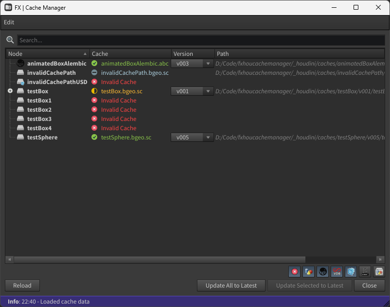
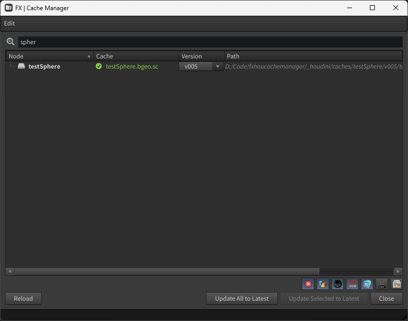
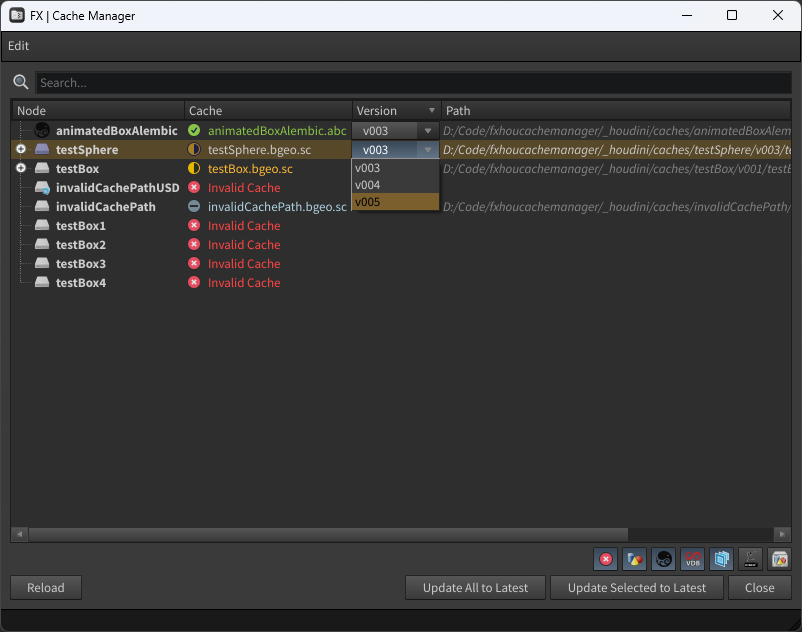
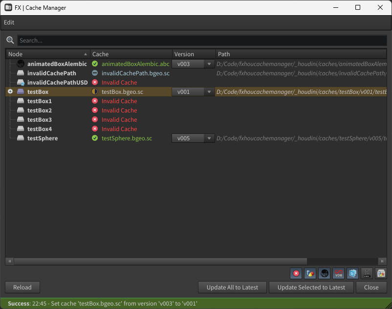
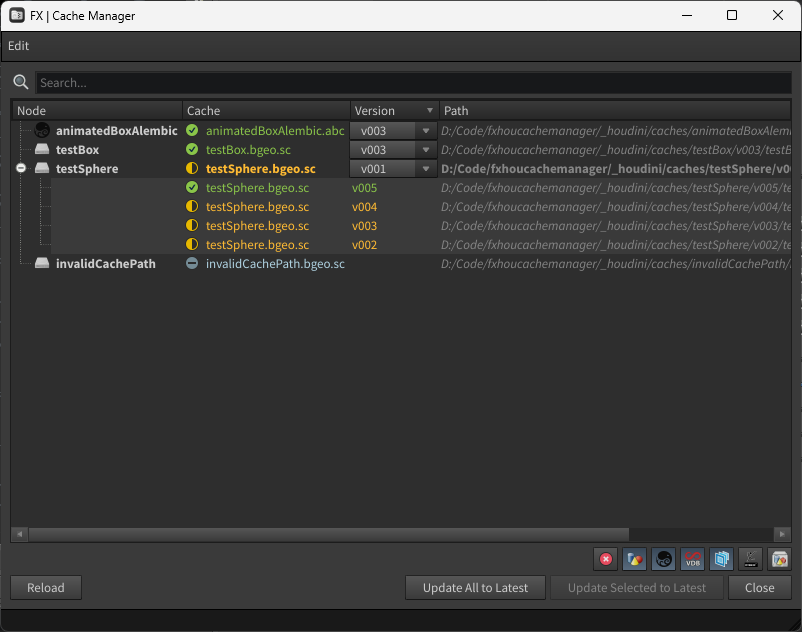
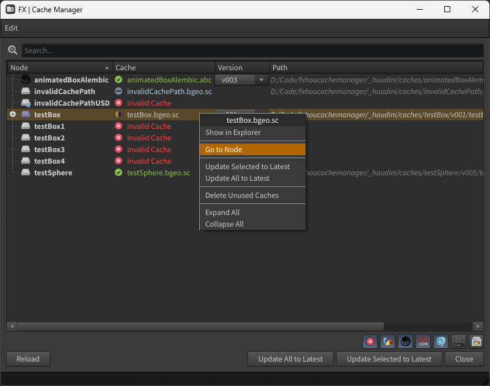
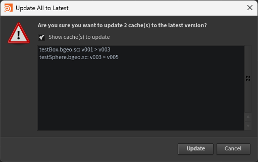
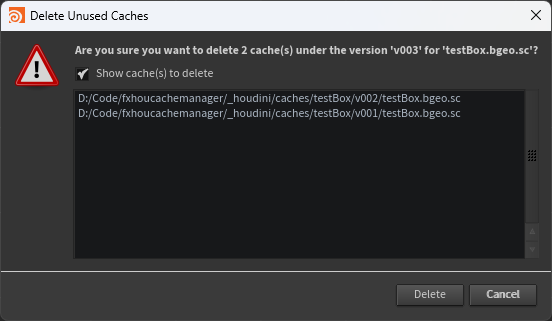
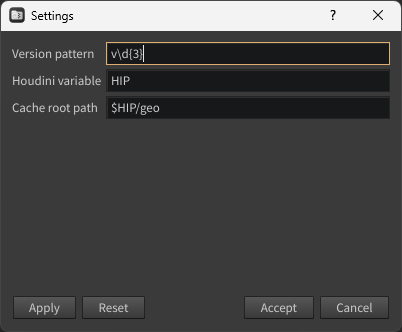

  
  

  <h3 align="center">fxcachemanager</h3>

  

    Cache manager for Houdini.
      
  

  ##

  

    <!-- Maintenance status -->
    &nbsp;&nbsp;
    <!-- &nbsp;&nbsp; -->
    <!-- License -->
    &nbsp;&nbsp;
    <!-- Last Commit -->
    &nbsp;&nbsp;
    <!-- Commit Activity -->
    &nbsp;&nbsp;
    <!-- GitHub stars -->
    &nbsp;&nbsp;
  

<!-- TABLE OF CONTENTS -->
## Table of Contents
<!--ts-->
   * [Installation](#installation)
   * [How-to Use](#how-to-use)
   * [Settings](#settings)
   * [Advanced](#advanced)
   * [Contact](#contact)
<!--te-->

<!-- INSTALLATION -->
## Installation

To install, simply copy-paste the [package.json](houdini/packages/fxhoucachemanager.json) file inside your `$HOUDINI_USER_PREF_DIR/packages` folder, and replace the value of the `$FXHOUCACHEMANAGER` path depending on your OS.

<!-- HOW-TO-USE -->
## How-to Use

You can launch the **FX Cache Manager** through the **FX** menu, or the **FX Cache Manager** shelf tool inside the **FX** shelf.

You will be presented with this UI:

  

  

The tool will scan for caches in the root folder you've set in the [settings](#settings).
The caches should be following this format `<cache_root>/<cache_name>/<cache_version>/<cache_name>.<ext>`, e.g. `$HIP/geo/flip/v001/flip.bgeo.sc`.

You can filter the caches by name, but also by extensions using the buttons on the bottom right of the UI.

  

You can use the dropdown menu to select the version you want to load. It will immediately load the cache in the scene.

  

  

You can expand the parent item to see all the versions available for a cache. The parent item will display the version currently loaded in the scene, and the children items will display the other versions available. The highest found version will be displayed in green, outdated versions will be displayed in yellow.

If a path is referenced but not found on disk, the version will be displayed in red. If the file exists on disk but doesn't follow the expected format, the version will be displayed in grey-blue.

  

A right-click on a selection of caches will open a context menu allowing you to perform a variety of actions:

  

When selecting **Update All to Latest** or **Delete Unused Caches**, a confirmation dialog will appear, asking you to confirm the action.

  

  

<!-- SETTINGS -->
## Settings

You can modify the settings of the tool by clicking on the **Edit** > **Settings** button, in the menu bar.
A dialog will appear, allowing you to set the regex pattern to use for the version extraction, the Houdini environment variable to use when looking for all the referenced files, and the root folder to scan for caches.

  

You can also set the logger verbosity level in the **Edit** > **Log Level** menu.

<!-- ADVANCED -->
## Advanced

The log and configuration files are stored in the `%APPDATA%/fxhoucachemanager` folder on Windows, and in the `$HOME/.fxhoucachemanager` folder on Linux and macOS.

<!-- CONTACT -->
## Contact

Project Link: [fxgui](https://github.com/healkeiser/fxhoucachemanager)

  <!-- GitHub profile -->
  &nbsp;&nbsp;
  <!-- LinkedIn -->
  &nbsp;&nbsp;
  <!-- Behance -->
  &nbsp;&nbsp;
  <!-- X -->
  &nbsp;&nbsp;
  <!-- Instagram -->
  &nbsp;&nbsp;
  <!-- Gumroad -->
  &nbsp;&nbsp;
  <!-- Gmail -->
  &nbsp;&nbsp;
  <!-- Buy me a coffee -->
  &nbsp;&nbsp;

